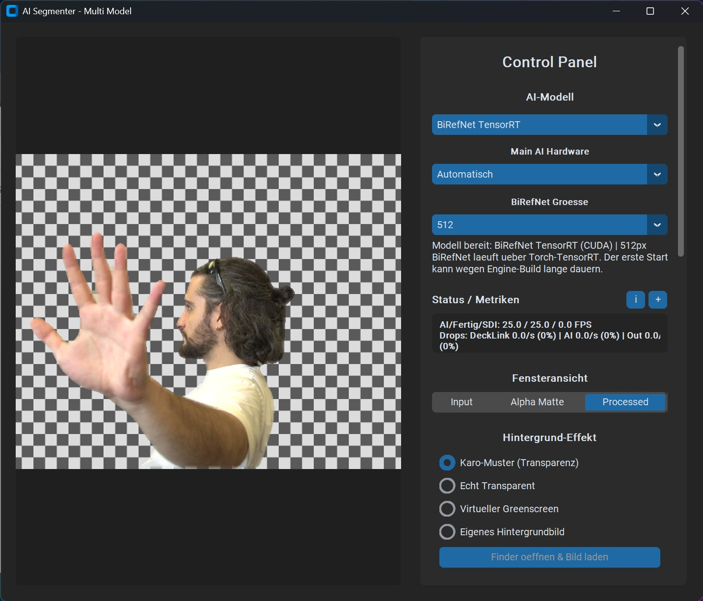
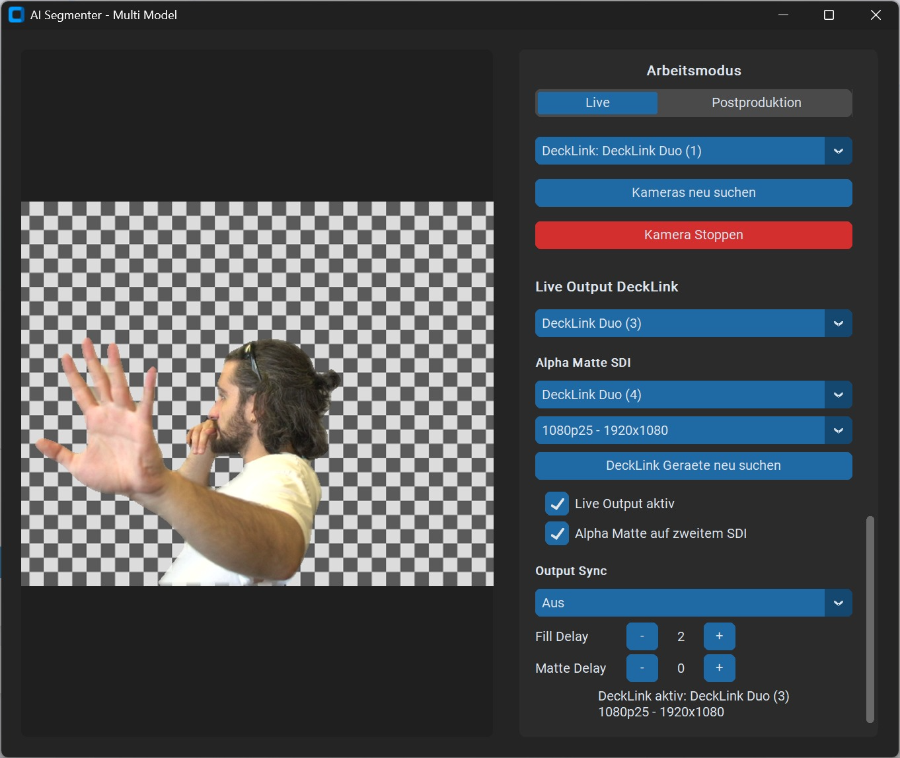

# AI Segmenter

AI Segmenter ist eine Windows-Desktop-Anwendung fuer Live- und Postproduktions-Segmentierung von Personen und Objekten. Das Programm kombiniert mehrere Segmentierungsmodelle, optionale YOLO-Objektauswahl, CorridorKey-Verfeinerung, Kamera-/DeckLink-Eingang und DeckLink Fill/Matte-Ausgabe in einer grafischen Oberflaeche.

Der Fokus liegt auf praktischer Videoarbeit: Live-Vorschau, transparente Ausgabe, Greenscreen-/Checker-Ansicht, Alpha-Matte, Postproduktion und Performance-Metriken sind direkt in der Anwendung verfuegbar.

## Inhaltsverzeichnis

- [Highlights](#highlights)
- [Screenshots](#screenshots)
- [Systemanforderungen](#systemanforderungen)
- [Installation](#installation)
- [Programm starten](#programm-starten)
- [Erster Workflow](#erster-workflow)
- [Programmoberflaeche](#programmoberflaeche)
- [Modelle und Backends](#modelle-und-backends)
- [Externe Modelle und Lizenzen](#externe-modelle-und-lizenzen)
- [Live-Modus](#live-modus)
- [Postproduktion](#postproduktion)
- [DeckLink-I/O](#decklink-io)
- [Metriken und Logs](#metriken-und-logs)
- [Projektstruktur](#projektstruktur)
- [Architektur](#architektur)
- [Entwicklung](#entwicklung)
- [Troubleshooting](#troubleshooting)
- [Release-Hinweise](#release-hinweise)

## Highlights

- Live-Segmentierung von Kamera- oder DeckLink-Quellen
- Mehrere Hauptmodelle:
  - MediaPipe Selfie
  - BiRefNet
  - BiRefNet TensorRT
  - RVM ByteDance
  - YOLO
  - YOLO TensorRT
- Optionale YOLO-Objektauswahl als Nachbearbeitung
- CorridorKey-Verfeinerung mit Despill und Despeckle
- Live-Vorschau mit Input, Alpha Matte oder verarbeitetem Bild
- Hintergrundmodi:
  - Checker
  - Transparent
  - Green
  - Custom Image
- DeckLink Fill-Ausgabe
- DeckLink Alpha-Matte-Ausgabe
- Output-Sync-Overlay mit Frame/Timecode
- Fill/Matte-Delay in Frames
- Postproduktion fuer Bilder und Videos
- Transparenter ProRes-4444-MOV-Export
- Live-Metriken, FPS, Latenz, Drops und CSV-Logs
- Modularer Open-Source-Aufbau als Python-Package

## Screenshots

Die folgenden Screenshots zeigen die Hauptbereiche der Anwendung.





Hinweis: Fuer oeffentliche Screenshots muessen Bildrechte und Einwilligungen
der abgebildeten Personen geklaert sein.

## Systemanforderungen

### Mindestanforderungen

- Windows 10 oder Windows 11
- Python 3.10 oder neuer
- Internetverbindung fuer die Erstinstallation
- Kamera, Videodatei oder Bilddatei als Quelle

### Empfohlen

- NVIDIA-GPU mit aktuellem Treiber fuer CUDA/TensorRT
- Blackmagic Desktop Video, falls DeckLink verwendet wird
- DeckLink-Karte fuer SDI-Input/Output
- FFmpeg fuer transparente ProRes-4444-Ausgabe

### Optional

- Blackmagic DeckLink Duo oder vergleichbare DeckLink-Hardware
- Separate SDI-Ausgaenge fuer Fill und Alpha Matte
- Lokale FFmpeg-Installation oder `ffmpeg.exe` im Projektordner

## Installation

### Schnelle Windows-Installation

Nach dem Download oder Klonen des Projekts:

```bat
installer_starten.bat
```

Der Installer erledigt unter anderem:

- Python-Umgebung `.venv` erstellen
- pip, wheel und setuptools vorbereiten
- PyTorch installieren
- CUDA-PyTorch verwenden, wenn NVIDIA/CUDA erkannt und ausgewaehlt wird
- BiRefNet-Abhaengigkeiten installieren
- TensorRT-Pakete installieren, wenn CUDA aktiv ist
- OpenCV mit contrib-Modulen installieren
- MediaPipe-Modell herunterladen
- CorridorKeyModule vorbereiten
- Modelle optional vorladen
- Starter-Dateien schreiben

Wenn Python fehlt, versucht der Starter Python 3.12 ueber `winget` zu installieren. Falls `winget` nicht verfuegbar ist, Python manuell installieren und beim Setup `Add python.exe to PATH` aktivieren.

### Frischer GitHub-Checkout

Ein frischer Checkout enthaelt bewusst keine lokale Umgebung und keine generierten Modellartefakte:

```text
.venv/                 nicht enthalten
logs/                  nicht enthalten
*.engine               nicht enthalten
*.onnx                 nicht enthalten
*.pt                   nicht enthalten
selfie_multiclass.tflite nicht enthalten
CorridorKeyModule/     wird vom Installer vorbereitet
```

Das ist gewollt. Diese Dateien werden installiert, heruntergeladen oder lokal erzeugt.

### Entwicklerinstallation

Der Windows-Installer ist der empfohlene Weg fuer die vollstaendige Anwendung. Fuer reine Entwicklung an Code, Tests und Dokumentation kann das Projekt auch als Package installiert werden:

```powershell
python -m venv .venv
.venv\Scripts\python.exe -m pip install --upgrade pip
.venv\Scripts\python.exe -m pip install -e ".[dev]"
```

Optionale Modell-Dependencies:

```powershell
.venv\Scripts\python.exe -m pip install -e ".[models]"
```

TensorRT bleibt hardware- und treiberabhaengig. Fuer produktive Windows-Setups ist daher weiterhin `installer_starten.bat` vorzuziehen.

## Programm starten

Nach erfolgreicher Installation:

```bat
start_programm.bat
```

Direkt aus der Projektumgebung:

```powershell
.venv\Scripts\python.exe -m ai_segmenter
```

Legacy-Einstiegspunkt:

```powershell
.venv\Scripts\python.exe script.py
```

`script.py` ist nur noch ein kompatibler Starter. Die eigentliche Anwendung liegt im Package `ai_segmenter`.

## Erster Workflow

1. `installer_starten.bat` ausfuehren.
2. Nach erfolgreicher Installation `start_programm.bat` starten.
3. Im Bereich `AI-Modell` ein Modell waehlen.
4. Unter `Arbeitsmodus` den Modus `Live` verwenden.
5. Kamera oder DeckLink-Quelle auswaehlen.
6. `Kamera Starten` klicken.
7. Unter `Fensteransicht` zwischen `Input`, `Alpha Matte` und `Processed` wechseln.
8. Optional YOLO, CorridorKey oder DeckLink Output aktivieren.
9. Fuer Datei-Export auf `Postproduktion` wechseln.

## Programmoberflaeche

Die Anwendung besteht aus einer grossen Vorschau links und einem rechten Control Panel.

### Vorschau

Die Vorschau zeigt je nach `Fensteransicht`:

- `Input`: Originalbild mit optionalem YOLO-Overlay
- `Alpha Matte`: berechnete Maske als Graubild
- `Processed`: freigestelltes oder zusammengesetztes Ergebnis

Die Vorschau skaliert responsiv innerhalb des Fensters.

### Control Panel

Das Control Panel ist scrollbar und in Funktionsbereiche gegliedert:

- AI-Modell
- Main AI Hardware
- Status / Metriken
- Fensteransicht
- Hintergrund-Effekt
- YOLO Objektauswahl
- CorridorKey
- Optimierung
- Arbeitsmodus
- Live-Quelle und DeckLink Output
- Postproduktion

Die Breite des Panels kann ueber den seitlichen Griff angepasst werden.

## Modelle und Backends

### MediaPipe Selfie

CPU-basiertes Basismodell fuer schnelle Segmentierung. Gut fuer einfache Setups und Systeme ohne starke GPU.

### BiRefNet

Hochwertiges Segmentierungsmodell fuer weichere und detailliertere Alpha-Masken. Kann je nach Hardware deutlich rechenintensiver sein.

### BiRefNet TensorRT

TensorRT-Variante fuer NVIDIA/CUDA-Systeme. Der erste Start kann wegen Engine-Build und Warmup laenger dauern.

### RVM ByteDance

Robust Video Matting-Modell fuer Video-Matting. Nutzt intern rekurrente Zustandsdaten.

### YOLO

Objektsegmentierung ueber Ultralytics YOLO. Kann als Hauptmodell oder als optionale Objektauswahl/Nachbearbeitung genutzt werden.

### YOLO TensorRT

Beschleunigte YOLO-Variante fuer NVIDIA/CUDA-Systeme. Engines werden lokal vorbereitet oder vom Installer erzeugt.

## Externe Modelle und Lizenzen

Dieses Repository enthaelt bewusst keine heruntergeladenen Modellgewichte,
Checkpoints, ONNX-Dateien oder TensorRT-Engines. Der Installer laedt oder
erzeugt diese Artefakte lokal.

Die MIT-Lizenz dieses Repositories gilt fuer den Anwendungscode. Externe
Bibliotheken, Modellgewichte und Modellquellen koennen eigene Lizenz- und
Nutzungsbedingungen haben. Details stehen in [docs/MODELS.md](docs/MODELS.md).

## Live-Modus

Im Live-Modus verarbeitet die Anwendung laufende Kamera- oder DeckLink-Frames.

### Live-Quellen

Die Anwendung sucht beim Start automatisch nach:

- DeckLink Inputs
- Windows-Kameras
- Capture Devices

Die Suche kann manuell ueber `Kameras neu suchen` wiederholt werden.

### Kamera starten/stoppen

`Kamera Starten` startet die Live-Pipeline:

- Capture-Thread
- AI-Worker
- Output-Thread
- Metrik-Logging

`Kamera Stoppen` beendet Threads, gibt Kamera/DeckLink frei und stoppt den Profiler.

### Hintergrund-Effekt

Verfuegbare Modi:

| Modus | Beschreibung |
| --- | --- |
| Checker | Schachbrett-Hintergrund zur Alpha-Kontrolle |
| Transparent | RGBA-Ausgabe in Postproduktion, transparente Vorschau bei passenden Frames |
| Green | Gruener Hintergrund mit einfachem Despill |
| CustomImage | Eigenes Hintergrundbild |

### Kanten-Optimierung

| Einstellung | Beschreibung |
| --- | --- |
| Kanten-Schrumpfung | Erodiert die Maske leicht, um Randartefakte zu reduzieren |
| Kanten-Weichheit | Weichzeichnet Alpha-Kanten |
| Live Fast Alpha | Nutzt bei kompatiblen CUDA-Modellen schnellere GPU-Pfade |

## YOLO Objektauswahl

YOLO kann als Hauptmodell oder als Nachbearbeitung genutzt werden.

### Funktionen

- YOLO aktivieren/deaktivieren
- YOLO-Modell waehlen
- Hardware waehlen
  - Automatisch
  - TensorRT
  - CPU
- Confidence einstellen
- Sync- oder Async-Nachbearbeitung waehlen
- Alle Objekte automatisch auswaehlen
- Einzelne erkannte Objekte in der Objektliste aktivieren/deaktivieren

### Sync vs Async

| Modus | Verhalten |
| --- | --- |
| Sync | YOLO wird framegenau in derselben Pipeline ausgefuehrt; genauer, aber langsamer |
| Async | YOLO laeuft im Neben-Thread; schneller fuer Live, nutzt die letzte verfuegbare Erkennung |

## CorridorKey

CorridorKey kann Alpha-Kanten verbessern und Farbraender reduzieren.

### Einstellungen

| Einstellung | Beschreibung |
| --- | --- |
| CorridorKey aktivieren | Laedt und nutzt CorridorKey |
| Hardware | Automatisch, CUDA oder CPU |
| Despill | Staerke der Farbrand-Reduktion |
| Despeckle | Entfernt kleine Stoerbereiche |

CorridorKey ist optional und kann die Pipeline je nach Hardware deutlich belasten.

## Postproduktion

Der Modus `Postproduktion` verarbeitet Dateien statt Live-Quellen.

### Unterstuetzte Eingaben

- Videos: `.mp4`, `.mov`, `.avi`, `.mkv`
- Bilder: `.jpg`, `.jpeg`, `.png`, `.bmp`, `.webp`

### Ausgabe

- PNG/JPEG fuer Bilder
- MP4 fuer normales Video
- MOV ProRes 4444 fuer transparente Videos

### Workflow

1. `Postproduktion` im Arbeitsmodus waehlen.
2. `Quelldatei waehlen`.
3. Optional `Speicherziel waehlen`.
4. Hintergrundmodus waehlen.
5. `Datei verarbeiten` starten.

Wenn `Transparent` aktiv ist, korrigiert die Anwendung Zielendungen automatisch:

- Bild -> `.png`
- Video -> `.mov`

## DeckLink-I/O

DeckLink-Funktionen benoetigen Blackmagic Desktop Video und kompatible Hardware.

### DeckLink Input

DeckLink Inputs erscheinen in der Live-Quellenliste als:

```text
DeckLink: <Geraetename>
```

Der Live-Modus nutzt den aktuell gewaehlten DeckLink-Modus fuer Input und Output.

### DeckLink Output

Verfuegbare Bereiche:

- `Live Output DeckLink`
- `Alpha Matte SDI`
- `DeckLink Modus`
- `DeckLink Geraete neu suchen`
- `Live Output aktivieren`
- `Alpha Matte aktivieren`

Fill und Alpha Matte muessen auf verschiedene DeckLink-Ausgaenge gelegt werden.

### Output Sync

| Option | Beschreibung |
| --- | --- |
| Aus | Kein Overlay |
| Frame | Frame-Nummer im Ausgang |
| Timecode | Timecode im Ausgang |
| Beides | Frame-Nummer und Timecode |

### Fill/Matte Delay

Fill und Matte koennen separat in Frames verzoegert werden:

- Fill Delay
- Matte Delay

Das hilft beim manuellen Abgleich externer SDI-Ketten.

## Metriken und Logs

Die Anwendung zeigt Live-Metriken im Control Panel:

- Modell
- Backend
- Quelle und Capture-FPS
- Verarbeitete FPS
- Verworfene FPS
- Latenz
- Rechenzeit
- Preprocess-Zeit
- Main-AI-Zeit
- Eingehende Datenrate
- Verarbeitete Datenrate
- Frame-Zaehler
- YOLO-Status
- Lesefehler

CSV-Logs werden unter `logs/` erzeugt. Diese Dateien sind Runtime-Artefakte und werden nicht versioniert.

## Projektstruktur

```text
ai_segmenter/
  __main__.py      Paket-Einstiegspunkt: python -m ai_segmenter
  app.py           Hauptfenster, App-State, Modellwechsel und Hintergrundbild-Laden
  app_icons.py     Fenster-/Taskleisten-Icons und Windows AppUserModelID
  camera.py        Kamera-Erkennung, Kamera-Backend-Auswahl und FPS-Messung
  config.py        Modell-, YOLO-, CorridorKey- und DeckLink-Konfiguration
  decklink.py      Blackmagic DeckLink Input/Output und Live-Quellen-Erkennung
  image_utils.py   Bild-/Alpha-Helferfunktionen
  live_output.py   Live-SDI-Ausgabe, Sync-Overlay und Fill/Matte-Verzoegerung
  metrics.py       Live-Metrik-Anzeige, Profiler-Start und Summary-Formatierung
  postprocessing.py
                   Postproduktion fuer Bilder, Videos und transparente ProRes-Ausgabe
  preview_renderer.py
                   Alpha-Nachbearbeitung, Hintergrundauswahl und Preview-Rendering
  profiler.py      Pipeline-Metriken und CSV-Logging
  runtime.py       Gemeinsame Runtime-Helfer fuer Torch/TensorRT/Logging
  utils.py         Kleine generische Laufzeit-Helfer
  yolo_controls.py YOLO-Laden, Objektauswahl, ROI-Logik und Overlay
  pipeline/
    __init__.py
    camera_lifecycle.py
                   Live-Quellenwechsel, Kamera-/DeckLink-Start, Stop und Shutdown
    live_pipeline.py
                   Live-Pipeline-Threads, Frame-Buffer, AI-Loop und Output-Loop
  ui/
    __init__.py
    app_layout.py  GUI-Aufbau, Control Panel, Preview-Layout und UI-Hilfsmethoden
  models/
    __init__.py
    birefnet.py
    corridorkey.py
    factory.py
    mediapipe_selfie.py
    rvm.py
    yolo.py
assets/
  ai_segmenter_program.ico
  ai_segmenter_installer.ico
install_windows.py
installer_starten.bat
start_programm.bat
script.py
README.md
```

### Einstiegspunkte

| Datei | Zweck |
| --- | --- |
| `ai_segmenter/__main__.py` | Primaerer Paketstart |
| `script.py` | Kompatibler Legacy-Starter |
| `installer_starten.bat` | Windows-Erstinstallation |
| `start_programm.bat` | Windows-Programmstart |

## Architektur

Eine detaillierte Einschaetzung der Modulgrenzen und der empfohlenen naechsten
Refactor-Schritte steht in [docs/ARCHITECTURE.md](docs/ARCHITECTURE.md).

## Entwicklung

### Lokale Syntaxpruefung

```powershell
$files = @("script.py", "install_windows.py") + `
  (Get-ChildItem ai_segmenter -Filter *.py).FullName + `
  (Get-ChildItem ai_segmenter\models -Filter *.py).FullName
.venv\Scripts\python.exe -m py_compile $files
```

### Unit-Tests

```powershell
.venv\Scripts\python.exe -m pytest
```

Die Unit-Tests decken bewusst zunaechst hardwareunabhaengige Teile ab, z.B. Kamera-Parsing, Bild-Helfer und Profiler-Grundverhalten.

### Import-Smoke-Test

```powershell
.venv\Scripts\python.exe -c "import script; from ai_segmenter.app import FoolproofSyncApp; import ai_segmenter.models; print('ok')"
```

### Manueller Funktionstest

Vor einem Release sollten mindestens diese Workflows getestet werden:

- Installer in einem frischen Ordner
- Start ueber `start_programm.bat`
- Start ueber `python -m ai_segmenter`
- Kamera-Suche
- Kamera starten/stoppen
- Modellwechsel
- YOLO aktivieren/deaktivieren
- CorridorKey aktivieren/deaktivieren
- DeckLink Input, falls Hardware vorhanden
- DeckLink Fill/Matte Output, falls Hardware vorhanden
- Bild-Postproduktion
- MP4-Postproduktion
- Transparent-MOV-Export
- Programm schliessen waehrend Live-Pipeline aktiv ist

## Troubleshooting

### Python wurde nicht gefunden

Python 3.10 oder neuer installieren und `Add python.exe to PATH` aktivieren. Danach `installer_starten.bat` erneut ausfuehren.

### Kamera wird nicht gefunden

- Kamera in anderen Programmen schliessen
- `Kameras neu suchen` klicken
- USB-/Capture-Geraet neu verbinden
- Windows-Kamera-Berechtigungen pruefen

### DeckLink wird nicht gefunden

- Blackmagic Desktop Video installieren
- Rechner neu starten
- DeckLink-Karte im Blackmagic Desktop Video Setup pruefen
- `DeckLink Geraete neu suchen` klicken

### DeckLink unterstuetzt Modus/Pixelformat nicht

Einige DeckLink-Ausgaenge unterstuetzen nicht jede Kombination aus Videomodus und Pixelformat. Einen anderen Modus testen, z.B. `1080p50`, `1080p30` oder `720p50`.

### TensorRT funktioniert nicht

- NVIDIA-Treiber aktualisieren
- CUDA-faehige GPU pruefen
- Installer erneut ausfuehren
- Falls Engine defekt ist, generierte `.engine`-Dateien loeschen und neu erzeugen lassen

### ProRes 4444 Export funktioniert nicht

FFmpeg installieren oder `ffmpeg.exe` in einen dieser Orte legen:

```text
Projektordner/
Projektordner/ffmpeg/bin/
Projektordner/bin/
```

Alternativ kann `imageio-ffmpeg` vom Installer bereitgestellt werden.

## Release-Hinweise

Diese Dateien und Ordner sollten nicht ins Repository:

```text
.venv/
logs/
__pycache__/
*.engine
*.onnx
*.pt
selfie_multiclass.tflite
CorridorKeyModule/checkpoints/
```

Grosse Modellgewichte und generierte Engines sollten ueber Installer, Cache oder GitHub Releases bereitgestellt werden, nicht direkt im Git-Verlauf.

## Lizenz

Dieses Projekt verwendet die MIT-Lizenz. Details stehen in [LICENSE](LICENSE).

Wichtig: Die MIT-Lizenz gilt fuer den Code dieses Repositories. Die Lizenzen externer Bibliotheken, Modelle und Modellgewichte muessen separat beachtet werden.

## Status

Das Projekt ist aktuell als Windows-Desktop-Anwendung strukturiert und modularisiert. Hardwareabhaengige Funktionen wie DeckLink, CUDA und TensorRT muessen auf entsprechender Zielhardware getestet werden.
